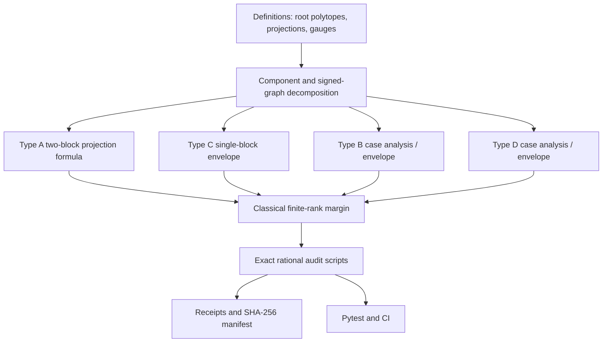

# Dependency Graph

```mermaid
flowchart TD
    A[Definitions: root polytopes, projections, gauges] --> B[Component and signed-graph decomposition]
    B --> C[Type A two-block projection formula]
    B --> D[Type C single-block envelope]
    B --> E[Type B case analysis / envelope]
    B --> F[Type D case analysis / envelope]
    C --> G[Classical finite-rank margin]
    D --> G
    E --> G
    F --> G
    G --> H[Exact rational audit scripts]
    H --> I[Receipts and SHA-256 manifest]
    H --> J[Pytest and CI]
```

## Reading note

This graph is a navigation aid. It does not prove the dependencies. Reviewers should verify each arrow against the manuscript and cited literature.
